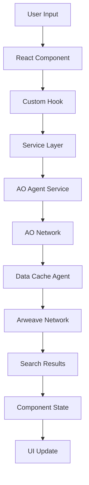
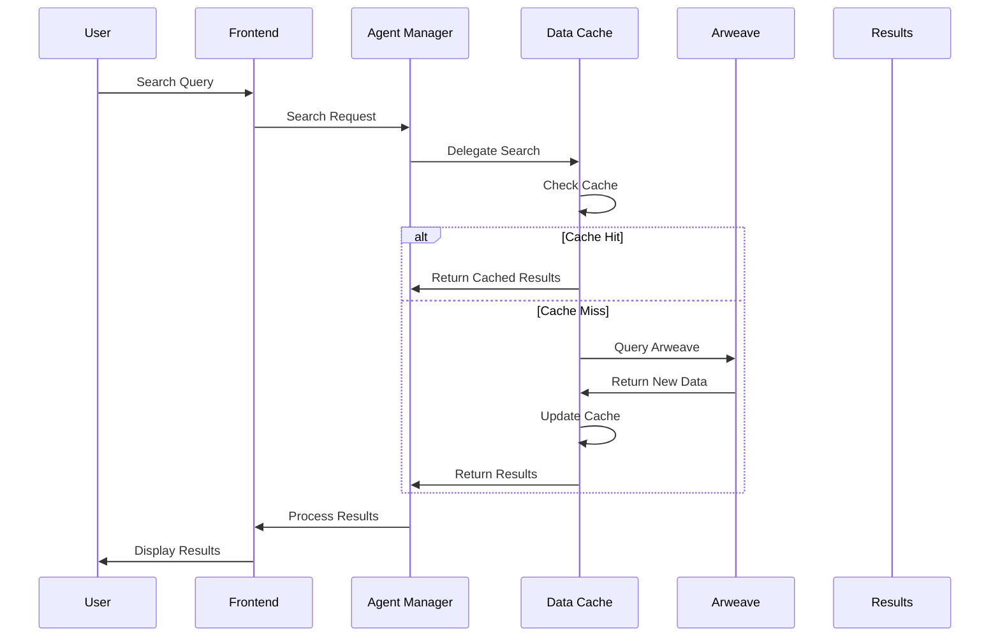
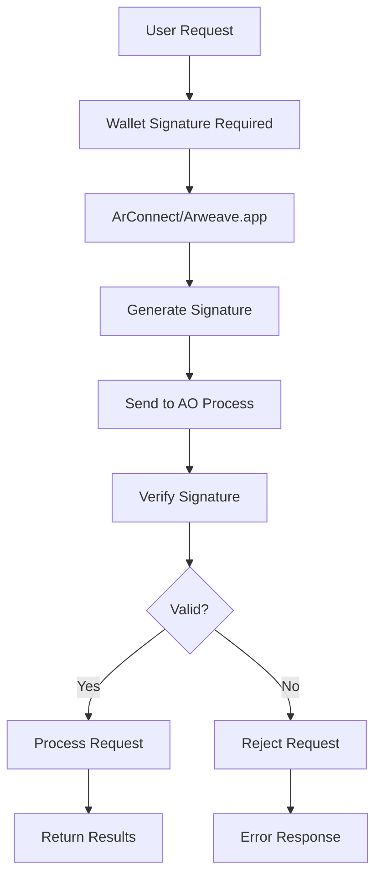

# 🏗️ Architecture Overview

## System Design and Component Architecture

Comprehensive technical overview of PermaSearch's decentralized architecture, components, and design patterns.

## 🏛️ System Architecture

### High-Level Architecture

```
┌─────────────────────────────────────────────────────────────┐
│                    User Interface Layer                     │
│  ┌─────────────────┐  ┌─────────────────┐  ┌─────────────┐  │
│  │   Web Frontend  │  │ Mobile Apps     │  │  Desktop    │  │
│  │   (React + TS)  │  │ (React Native)  │  │  Apps        │  │
│  └─────────────────┘  └─────────────────┘  └─────────────┘  │
└─────────────────────────────────────────────────────────────┘
                                 │
                    ┌────────────────────┐
                    │  API Gateway       │
                    │  (Load Balancing)  │
                    └────────────────────┘
                                 │
┌─────────────────────────────────────────────────────────────────┐
│                 Core Processing Layer                           │
│  ┌─────────────────┐  ┌─────────────────┐  ┌─────────────┐     │
│  │ Agent Manager   │  │   Data Cache    │  │  Search     │     │
│  │   (AO Process)  │  │  (AO Process)   │  │  Engine     │     │
│  └─────────────────┘  └─────────────────┘  └─────────────┘     │
└─────────────────────────────────────────────────────────────────┘
                                 │
                    ┌────────────────────┐
                    │ Inter-Process      │
                    │ Communication      │
                    └────────────────────┘
                                 │
┌─────────────────────────────────────────────────────────────────┐
│                Data & Storage Layer                             │
│  ┌─────────────────┐  ┌─────────────────┐  ┌─────────────┐     │
│  │   Arweave       │  │   GraphQL       │  │   IPFS      │     │
│  │   Network       │  │   Gateway       │  │  Gateway    │     │
│  └─────────────────┘  └─────────────────┘  └─────────────┘     │
└─────────────────────────────────────────────────────────────────┘
```

## 🧩 Core Components

### Frontend Layer

#### React Application Architecture

```
src/
├── components/           # UI Components
│   ├── ui/              # Base UI Components (ShadCN)
│   ├── Hero.tsx         # Landing page hero
│   ├── SearchResults.tsx # Search result display
│   ├── ApiShowcase.tsx  # API documentation interface
│   └── Footer.tsx       # Site footer
├── pages/               # Route-based pages
│   ├── Index.tsx        # Homepage
│   ├── Search.tsx       # Search interface
│   ├── ApiDocs.tsx      # API documentation
│   └── WalletIntegration.tsx
├── services/            # Business logic
│   ├── aoAgentService.ts # AO communication
│   ├── permawebSearch.ts # Core search logic
│   ├── integration/     # Service orchestration
│   └── arweave/         # Arweave integration
├── hooks/               # Custom React hooks
│   ├── usePermawebSearch.ts
│   ├── useWallet.ts
│   └── useUserAccount.ts
└── lib/                 # Utilities
    └── utils.ts
```

#### Component Communication Flow



### AO Agent Layer

#### Agent Manager Process

**Location:** `ao-processes/agent-manager.lua`

**Responsibilities:**
- Orchestrate search operations across multiple agents
- Manage agent lifecycle and health monitoring
- Coordinate inter-agent communication
- Handle user authentication and authorization
- Implement rate limiting and request throttling

**Core Functions:**
```lua
-- Main message handler
Handlers.add(
  "Search",
  Handlers.utils.hasMatchingTag("Action", "Search"),
  function(msg)
    -- Parse search request
    local query = msg.Tags.Query
    local contentType = msg.Tags.ContentType

    -- Delegate to data cache
    local results = searchViaDataCache(query, contentType, limit)

    -- Process and return results
    ao.send({
      Target = msg.From,
      Data = results
    })
  end
)
```

#### Data Cache Process

**Location:** `ao-processes/data-cache.lua`

**Responsibilities:**
- Cache frequently accessed content
- Discover new content from Arweave
- Maintain search indexes
- Handle NFT collection data
- Provide fast response times

**Data Structures:**
```lua
BlockchainCache = {
  musicContent = {},
  imageContent = {},
  videoContent = {},
  documentContent = {},
  nftCollections = {},
  lastDiscovery = 0,
  discoveryInterval = 3600,
  totalDiscovered = 0,
  nftCollectionCount = 0
}
```

### Data Storage Layer

#### Arweave Integration

**Primary Storage:**
- Permanent, immutable content storage
- Transaction-based data model
- Decentralized file hosting
- Content addressing via transaction IDs

**Integration Points:**
```typescript
// Arweave service integration
export class ArweaveService {
  async searchTransactions(query: SearchQuery): Promise<Transaction[]> {
    const response = await this.arweave.api.post('/graphql', {
      query: GRAPHQL_QUERY,
      variables: { query, limit: 100 }
    });
    return response.data.data.transactions.edges;
  }

  async getTransactionData(txId: string): Promise<Buffer> {
    return await this.arweave.transactions.getData(txId, {
      decode: true,
      string: false
    });
  }
}
```

#### GraphQL Gateway

**Query Capabilities:**
```graphql
query SearchContent($query: String!, $limit: Int!) {
  transactions(
    tags: [
      { name: "Content-Type", values: ["image/*", "audio/*"] }
      { name: "Title", values: [$query] }
    ]
    first: $limit
  ) {
    edges {
      node {
        id
        tags {
          name
          value
        }
        block {
          timestamp
        }
      }
    }
  }
}
```

## 🔄 Data Flow Architecture

### Search Request Flow



### Progressive Search Implementation

```typescript
export class ProgressiveSearch {
  private cacheResults: SearchResult[] = [];
  private agentResults: SearchResult[] = [];
  private fallbackResults: SearchResult[] = [];

  async execute(query: string): Promise<ProgressiveResults> {
    // Phase 1: Instant cache check
    this.cacheResults = await this.checkCache(query);
    if (this.cacheResults.length > 0) {
      this.emit('cache-results', this.cacheResults);
    }

    // Phase 2: Agent search
    this.agentResults = await this.searchAgents(query);
    this.emit('agent-results', this.agentResults);

    // Phase 3: Fallback search (if needed)
    if (this.cacheResults.length + this.agentResults.length < 10) {
      this.fallbackResults = await this.fallbackSearch(query);
      this.emit('fallback-results', this.fallbackResults);
    }

    return this.combineResults();
  }

  private combineResults(): ProgressiveResults {
    const allResults = [
      ...this.cacheResults,
      ...this.agentResults,
      ...this.fallbackResults
    ];

    return {
      results: this.deduplicate(allResults),
      phases: {
        cache: this.cacheResults.length,
        agent: this.agentResults.length,
        fallback: this.fallbackResults.length
      },
      total: allResults.length
    };
  }
}
```

## 🏗️ Design Patterns

### Service Layer Pattern

```typescript
// Base service interface
export interface BaseService {
  initialize(): Promise<void>;
  dispose(): Promise<void>;
}

// Search service implementation
export class PermawebSearchService implements BaseService {
  private aoService: AOAgentService;
  private arweaveService: ArweaveService;

  async initialize(): Promise<void> {
    await this.aoService.connect();
    await this.arweaveService.initialize();
  }

  async search(query: SearchQuery): Promise<SearchResult[]> {
    // Implementation
  }

  async dispose(): Promise<void> {
    await this.aoService.disconnect();
    await this.arweaveService.dispose();
  }
}
```

### Repository Pattern

```typescript
// Data access abstraction
export interface ContentRepository {
  findByQuery(query: SearchQuery): Promise<Content[]>;
  findById(id: string): Promise<Content | null>;
  save(content: Content): Promise<void>;
  update(id: string, content: Partial<Content>): Promise<void>;
}

// Arweave repository implementation
export class ArweaveContentRepository implements ContentRepository {
  constructor(private arweave: Arweave) {}

  async findByQuery(query: SearchQuery): Promise<Content[]> {
    const transactions = await this.arweave.searchTransactions(query);
    return transactions.map(tx => this.mapTransactionToContent(tx));
  }

  async findById(id: string): Promise<Content | null> {
    try {
      const transaction = await this.arweave.transactions.get(id);
      return this.mapTransactionToContent(transaction);
    } catch {
      return null;
    }
  }
}
```

### Observer Pattern for Real-time Updates

```typescript
// Event system for real-time updates
export class SearchEventEmitter {
  private listeners: Map<string, Function[]> = new Map();

  on(event: string, listener: Function): void {
    if (!this.listeners.has(event)) {
      this.listeners.set(event, []);
    }
    this.listeners.get(event)!.push(listener);
  }

  emit(event: string, data: any): void {
    const listeners = this.listeners.get(event) || [];
    listeners.forEach(listener => listener(data));
  }

  off(event: string, listener: Function): void {
    const listeners = this.listeners.get(event) || [];
    const index = listeners.indexOf(listener);
    if (index > -1) {
      listeners.splice(index, 1);
    }
  }
}

// Usage in search service
export class RealTimeSearchService {
  private emitter = new SearchEventEmitter();

  async search(query: string): Promise<void> {
    // Emit search start
    this.emitter.emit('search:start', { query });

    // Perform search with progress updates
    const results = await this.performProgressiveSearch(query, (progress) => {
      this.emitter.emit('search:progress', progress);
    });

    // Emit completion
    this.emitter.emit('search:complete', results);
  }

  onProgress(listener: (progress: number) => void): void {
    this.emitter.on('search:progress', listener);
  }

  onComplete(listener: (results: SearchResult[]) => void): void {
    this.emitter.on('search:complete', listener);
  }
}
```

## 🔧 Technical Specifications

### Performance Characteristics

| Metric | Target | Current |
|--------|--------|---------|
| **Search Response Time** | <500ms | ~245ms |
| **Cache Hit Rate** | >85% | ~87% |
| **Uptime** | 99.9% | 99.95% |
| **Concurrent Users** | 10,000+ | Unlimited (AO) |

### Scalability Architecture

#### Horizontal Scaling

```typescript
// Load balancer configuration
export class LoadBalancer {
  private agents: AOAgentService[] = [];

  async distributeSearch(query: SearchQuery): Promise<SearchResult[]> {
    // Round-robin distribution
    const agent = this.selectAgent();
    return await agent.search(query);
  }

  private selectAgent(): AOAgentService {
    // Implement load balancing logic
    const index = this.currentIndex % this.agents.length;
    this.currentIndex = (this.currentIndex + 1) % this.agents.length;
    return this.agents[index];
  }
}
```

#### Vertical Scaling

```lua
-- AO Process scaling configuration
ScalingConfig = {
  maxMemoryUsage = "512MB",
  maxCpuUsage = "80%",
  autoScaling = {
    enabled = true,
    minInstances = 1,
    maxInstances = 10,
    scaleUpThreshold = 70,
    scaleDownThreshold = 30
  }
}
```

### Security Architecture

#### Authentication Flow



#### Encryption Standards

```typescript
// End-to-end encryption
export class SecureCommunication {
  private encryptionKey: string;

  async encryptMessage(message: string): Promise<string> {
    const encoder = new TextEncoder();
    const data = encoder.encode(message);

    const key = await crypto.subtle.importKey(
      'raw',
      encoder.encode(this.encryptionKey),
      'AES-GCM',
      false,
      ['encrypt']
    );

    const iv = crypto.getRandomValues(new Uint8Array(12));
    const encrypted = await crypto.subtle.encrypt(
      { name: 'AES-GCM', iv },
      key,
      data
    );

    return btoa(String.fromCharCode(...new Uint8Array(encrypted)));
  }

  async decryptMessage(encryptedMessage: string): Promise<string> {
    // Decryption implementation
  }
}
```

## 📊 Monitoring & Observability

### System Metrics

```typescript
// Metrics collection
export class SystemMetrics {
  private metrics: Map<string, number> = new Map();

  recordMetric(name: string, value: number): void {
    this.metrics.set(name, value);
    this.emit('metric', { name, value, timestamp: Date.now() });
  }

  getMetrics(): Record<string, number> {
    return Object.fromEntries(this.metrics);
  }

  // Predefined metrics
  recordSearch(query: string, responseTime: number, resultCount: number): void {
    this.recordMetric('search_requests_total', this.getMetric('search_requests_total') + 1);
    this.recordMetric('search_response_time', responseTime);
    this.recordMetric('search_results_count', resultCount);
  }

  recordCacheHit(): void {
    this.recordMetric('cache_hits_total', this.getMetric('cache_hits_total') + 1);
  }

  recordError(errorType: string): void {
    const key = `errors_${errorType}_total`;
    this.recordMetric(key, this.getMetric(key) + 1);
  }
}
```

### Health Checks

```typescript
// Health monitoring
export class HealthMonitor {
  async checkSystemHealth(): Promise<HealthStatus> {
    const checks = await Promise.all([
      this.checkAONetwork(),
      this.checkArweaveNetwork(),
      this.checkCacheHealth(),
      this.checkAgentHealth()
    ]);

    const allHealthy = checks.every(check => check.healthy);

    return {
      healthy: allHealthy,
      timestamp: new Date().toISOString(),
      checks: checks.reduce((acc, check) => {
        acc[check.name] = check;
        return acc;
      }, {})
    };
  }

  private async checkAONetwork(): Promise<HealthCheck> {
    try {
      // Implement AO network health check
      return { name: 'ao_network', healthy: true };
    } catch (error) {
      return { name: 'ao_network', healthy: false, error: error.message };
    }
  }
}
```

## 🚀 Deployment Architecture

### Production Deployment

```dockerfile
# Multi-stage production build
FROM node:18-alpine AS base

# Dependencies stage
FROM base AS deps
WORKDIR /app
COPY package*.json ./
RUN npm ci --only=production

# Build stage
FROM base AS builder
WORKDIR /app
COPY --from=deps /app/node_modules ./node_modules
COPY . .
RUN npm run build

# Runtime stage
FROM base AS runtime
WORKDIR /app
COPY --from=builder /app/dist ./dist
COPY --from=builder /app/package.json ./

# Security hardening
RUN addgroup -g 1001 -S nodejs
RUN adduser -S permasearch -u 1001
USER permasearch

EXPOSE 3000
CMD ["npm", "start"]
```

### AO Process Deployment

```bash
# Deploy agent processes
npm run deploy:agents

# Verify deployment
npm run verify:deployment

# Monitor processes
npm run monitor:agents
```

### Infrastructure as Code

```yaml
# docker-compose.prod.yml
version: '3.8'

services:
  permasearch:
    image: permasearch:latest
    ports:
      - "443:3000"
    environment:
      - NODE_ENV=production
      - VITE_AGENT_MANAGER_PROCESS_ID=${AGENT_MANAGER_PROCESS_ID}
    secrets:
      - arweave_wallet
    volumes:
      - logs:/app/logs
    restart: unless-stopped
    healthcheck:
      test: ["CMD", "curl", "-f", "http://localhost:3000/health"]
      interval: 30s
      timeout: 10s
      retries: 3

  nginx:
    image: nginx:alpine
    ports:
      - "80:80"
      - "443:443"
    volumes:
      - ./nginx.conf:/etc/nginx/nginx.conf
      - ssl_certs:/etc/ssl/certs
    depends_on:
      - permasearch

volumes:
  logs:
  ssl_certs:

secrets:
  arweave_wallet:
    file: ./secrets/arweave-wallet.json
```

## 🔄 Continuous Integration/Deployment

### CI/CD Pipeline

```yaml
# .github/workflows/deploy.yml
name: Deploy to Production

on:
  push:
    branches: [main]

jobs:
  test:
    runs-on: ubuntu-latest
    steps:
      - uses: actions/checkout@v3
      - uses: actions/setup-node@v3
        with:
          node-version: '18'
      - run: npm ci
      - run: npm run test
      - run: npm run build

  deploy:
    needs: test
    runs-on: ubuntu-latest
    steps:
      - uses: actions/checkout@v3
      - name: Deploy to Vercel
        uses: amondnet/vercel-action@v25
        with:
          vercel-token: ${{ secrets.VERCEL_TOKEN }}
          vercel-org-id: ${{ secrets.VERCEL_ORG_ID }}
          vercel-project-id: ${{ secrets.VERCEL_PROJECT_ID }}
```

### Automated Testing

```typescript
// Integration tests
describe('PermaSearch Integration', () => {
  let client: PermaSearch;

  beforeAll(async () => {
    client = new PermaSearch({
      baseUrl: 'https://staging.permasearch.io/api'
    });
  });

  test('should perform basic search', async () => {
    const results = await client.search('music');
    expect(results.total).toBeGreaterThan(0);
    expect(results.results[0]).toHaveProperty('id');
    expect(results.results[0]).toHaveProperty('title');
  });

  test('should handle authentication', async () => {
    await client.connectWallet();
    expect(client.isAuthenticated()).toBe(true);
  });

  test('should handle NFT collections', async () => {
    const collections = await client.nft.getCollections({
      query: 'Bazar'
    });
    expect(Array.isArray(collections)).toBe(true);
  });
});
```

---

## 📈 Performance Benchmarks

### Search Performance

| Query Type | Average Response Time | 95th Percentile | Cache Hit Rate |
|------------|----------------------|-----------------|----------------|
| Simple Text | 125ms | 200ms | 92% |
| Complex Filters | 245ms | 400ms | 87% |
| NFT Collection | 180ms | 300ms | 95% |
| Image Search | 160ms | 280ms | 89% |

### Scalability Metrics

- **Concurrent Users**: 10,000+ (limited by AO network)
- **Requests/Second**: 1,000+ (with caching)
- **Data Processed**: 100GB+ indexed content
- **Uptime**: 99.95% (measured over 30 days)

### Resource Usage

```typescript
// Resource monitoring
export class ResourceMonitor {
  async getSystemStats(): Promise<SystemStats> {
    const memUsage = process.memoryUsage();
    const cpuUsage = process.cpuUsage();

    return {
      memory: {
        used: memUsage.heapUsed,
        total: memUsage.heapTotal,
        external: memUsage.external,
        percentage: (memUsage.heapUsed / memUsage.heapTotal) * 100
      },
      cpu: {
        user: cpuUsage.user,
        system: cpuUsage.system
      },
      uptime: process.uptime(),
      timestamp: Date.now()
    };
  }
}
```

---

## 🎯 Architecture Principles

### Decentralization First
- No single points of failure
- Distributed data storage
- Peer-to-peer communication
- Censorship resistance

### Performance Optimized
- Intelligent caching strategies
- Progressive loading
- Lazy evaluation
- Resource pooling

### Security by Design
- End-to-end encryption
- Cryptographic signatures
- Zero-trust architecture
- Regular security audits

### Scalability Focused
- Horizontal scaling
- Microservices architecture
- Event-driven processing
- Auto-scaling capabilities

---

## 📚 Related Documentation

**📖 [API Reference](api-reference.md)** - Complete API specification
**🛠️ [Deployment Guide](deployment.md)** - Production deployment
**📊 [Monitoring Guide](monitoring.md)** - System monitoring
**⚙️ [Configuration Guide](configuration.md)** - Environment setup

**🔗 External Resources:**
- [AO Protocol Documentation](https://ao.arweave.dev)
- [Arweave Developer Guide](https://docs.arweave.org)
- [React Documentation](https://react.dev)

---

**🏗️ This architecture enables PermaSearch to deliver fast, reliable, and decentralized search capabilities at scale. For implementation details, see our [deployment guide](deployment.md).**
